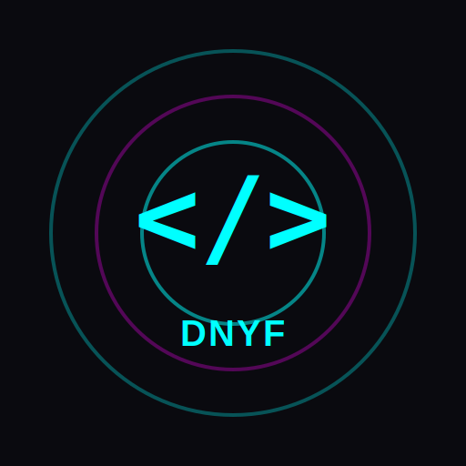

# 🚀 DNYF DevStudio

<div align="center">



**Professional Web-Based IDE & Developer Toolkit**

[](LICENSE)
[]()
[]()

*Built with ❤️ by DNYFTECH*

[Live Demo](https://dnyftech.github.io/devstudio) | [Report Bug](https://github.com/DNYFTECH/devstudio/issues) | [Request Feature](https://github.com/DNYFTECH/devstudio/issues)

</div>

---

## ✨ Features

### 🎨 **Professional Monaco Editor Integration**
- Full-featured code editor with syntax highlighting
- Multi-language support (JavaScript, TypeScript, Python, HTML, CSS, and more)
- IntelliSense, autocomplete, and code formatting
- Customizable themes and settings

### 📁 **Advanced File Management**
- Create, edit, and delete files
- Persistent storage with IndexedDB
- File search and organization
- Import/Export projects
- Auto-save functionality

### 🎯 **Live Preview**
- Real-time HTML/CSS/JS preview
- Responsive preview modes
- External window preview
- Instant updates

### 🌐 **API Testing Suite**
- HTTP request builder (GET, POST, PUT, PATCH, DELETE)
- Custom headers and body
- Response viewer with syntax highlighting
- Request history
- Response time tracking

### 📚 **Code Snippets Library**
- Save frequently used code snippets
- Organize by language
- Quick search and filter
- One-click copy to clipboard

### 💻 **Console Output**
- JavaScript execution sandbox
- Real-time console logging
- Error tracking
- Export console history

### 🔌 **PWA Capabilities**
- **Offline-First**: Works without internet connection
- **Installable**: Add to home screen on mobile/desktop
- **Fast Loading**: Service worker caching
- **Persistent Storage**: IndexedDB for file storage
- **File Handling**: Open files directly in the app
- **Share Target**: Share code to DevStudio

### 🎨 **Cyberpunk UI Theme**
- Distinctive neon-accented design
- Smooth animations and transitions
- Responsive layout
- Dark mode optimized
- Custom fonts (Orbitron, Fira Code, Rajdhani)

---

## 🚀 Quick Start

### Prerequisites
- Node.js 16+ and npm/yarn
- Modern web browser (Chrome, Firefox, Safari, Edge)

### Installation

```bash
# Clone the repository
git clone https://github.com/DNYFTECH/devstudio.git
cd devstudio

# Install dependencies
npm install

# Start development server
npm run dev

# Build for production
npm run build

# Preview production build
npm run preview
```

### Deploy to GitHub Pages

```bash
# Build and deploy
npm run deploy
```

The app will be available at `https://[your-username].github.io/devstudio/`

---

## 📖 Usage Guide

### Creating Files
1. Click the **+** button in the File Explorer
2. Enter filename with extension (e.g., `app.js`, `index.html`)
3. Start coding in the Monaco editor

### Using Live Preview
1. Create HTML, CSS, or JS files
2. The preview panel updates automatically
3. Click the **External Link** button to open in a new tab

### API Testing
1. Open the API Tester panel
2. Enter your endpoint URL
3. Select HTTP method
4. Add headers and body (optional)
5. Click **Send** to make the request

### Saving Snippets
1. Open the Snippets panel
2. Click **New** to create a snippet
3. Add title, select language, and paste code
4. Save for quick access later

### Keyboard Shortcuts
- `Ctrl/Cmd + S` - Save current file
- `Ctrl/Cmd + C` - Copy selected code

---

## 🏗️ Tech Stack

### Frontend
- **React 18** - UI framework
- **Vite** - Build tool
- **Monaco Editor** - Code editor (powers VS Code)
- **Framer Motion** - Animations
- **Zustand** - State management

### Storage & Offline
- **Dexie.js** - IndexedDB wrapper
- **Workbox** - Service worker management
- **PWA Plugin** - Progressive Web App configuration

### Styling
- **CSS3** with Custom Properties
- **Google Fonts** (Orbitron, Fira Code, Rajdhani)
- **Cyberpunk Design System**

---

## 📱 PWA Installation

### Desktop (Chrome/Edge)
1. Visit the app URL
2. Click the install icon in the address bar
3. Click "Install"

### Mobile (Android/iOS)
1. Visit the app URL
2. Tap the browser menu
3. Select "Add to Home Screen" or "Install App"

### Benefits of Installing
- 🚀 Faster load times
- 📴 Offline access
- 🎨 Native app experience
- 📂 File association support

---

## 🔧 Configuration

### Editor Settings
Access settings through the top bar to customize:
- Font size
- Tab size
- Word wrap
- Minimap
- Line numbers
- Format on save/paste

### Customization
Edit `vite.config.js` for build configuration
Edit `src/styles/global.css` for theme customization

---

## 🌐 Browser Support

| Browser | Version | Support |
|---------|---------|---------|
| Chrome  | 90+     | ✅ Full |
| Firefox | 88+     | ✅ Full |
| Safari  | 14+     | ✅ Full |
| Edge    | 90+     | ✅ Full |

---

## 🤝 Contributing

Contributions are welcome! Here's how you can help:

1. Fork the repository
2. Create a feature branch (`git checkout -b feature/AmazingFeature`)
3. Commit your changes (`git commit -m 'Add AmazingFeature'`)
4. Push to the branch (`git push origin feature/AmazingFeature`)
5. Open a Pull Request

---

## 📄 License

This project is licensed under the MIT License - see the [LICENSE](LICENSE) file for details.

---

## 🙏 Acknowledgments

- Monaco Editor by Microsoft
- React team for the amazing framework
- Vite for blazing fast builds
- All open-source contributors

---

## 📞 Contact & Support

- **GitHub**: [@DNYFTECH](https://github.com/DNYFTECH)
- **Issues**: [Report Bug](https://github.com/DNYFTECH/devstudio/issues)
- **Website**: [DNYF Projects](https://github.com/DNYFTECH)

---

## 🗺️ Roadmap

- [ ] Git integration
- [ ] Collaborative editing
- [ ] Plugin system
- [ ] Terminal emulator
- [ ] Docker integration
- [ ] Cloud sync
- [ ] Mobile app (React Native)
- [ ] AI code completion
- [ ] Theme marketplace
- [ ] Multi-file search

---

<div align="center">

**Made with 💙 by DNYFTECH**

⭐ Star this repo if you find it useful!

</div>
